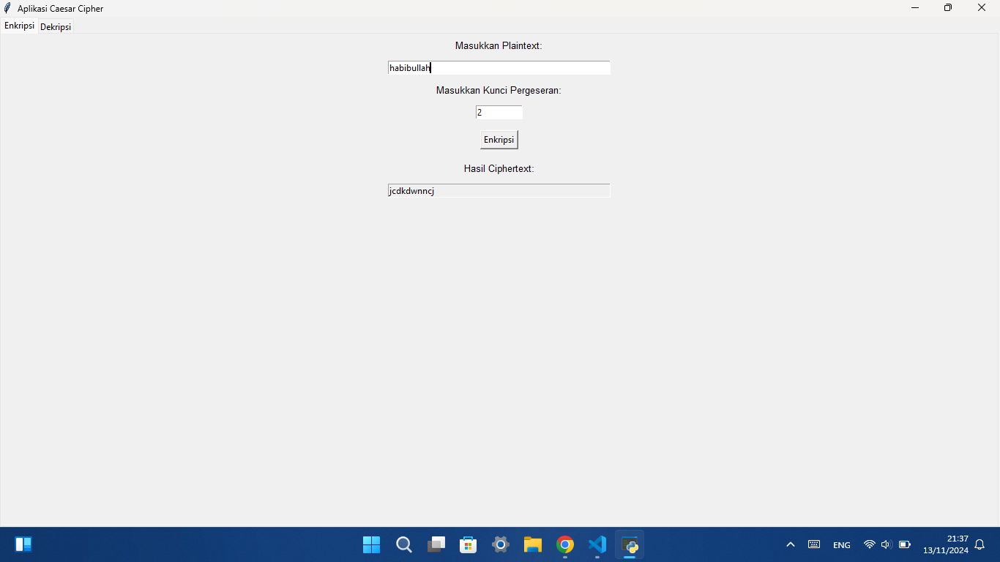

# Caesar Cipher App
Aplikasi sederhana untuk enkripsi dan dekripsi menggunakan metode Caesar Cipher. Dibuat menggunakan Python dengan antarmuka pengguna grafis (GUI) menggunakan Tkinter.

## Fitur
- Enkripsi teks menggunakan metode Caesar Cipher dengan kunci pergeseran yang dapat disesuaikan.
- Dekripsi teks menggunakan metode yang sama dengan kunci pergeseran.

## Tampilan Aplikasi
### Tab Enkripsi


### Tab Dekripsi


## Cara Menjalankan
1. Pastikan Anda sudah menginstal Python di komputer Anda.
2. Download atau clone repository ini.
3. Buka Terminal atau Command Prompt, lalu jalankan perintah berikut:
   ```bash
   python caesarcipher.py
